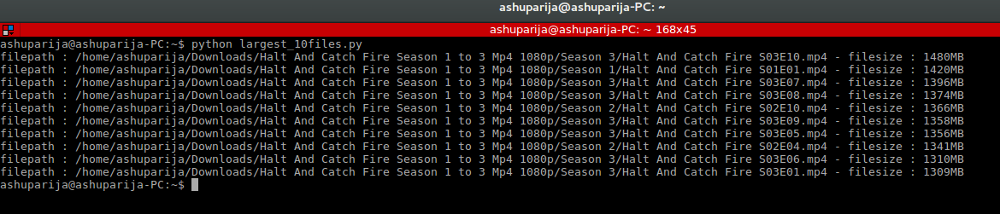
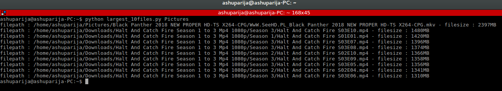
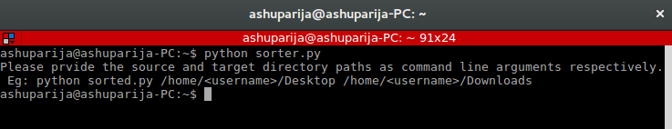

# innovaccer-task

Problem statements which are solved:

Problem statement 1 : Create a program/script that should scan all the Drives and folders like C:/User/* (Windows) 
and /home/* (Linux) recursively and then identify the top 10 files which have the largest size on the system.

Problem Statement 2 : The program should sort the files on Desktop on the basis of file extension and move them in 
separate folders in Documents folder.  

The solution presented

Solution 1 : A program which can recursively scan and identify the top 10 files which have the largest size among
the allowed directories to scan. By default the program will only scan the Downloads folder but we can specify any directories
we want the program to scan as command line inputs.

Solution 2 : A program which takes source path and target path as command line arguments and then sort the files 
at source on the basis of file extension and move them in separate folders inside target folder. 
NOTE : All the symlinks are ignored.

### Requirements :
+ No extra requirements

### Instructions :

``bash
# Clone this repository
git clone https://github.com/ashuparija/innovaccer-task.git

# Go into the repository
cd innovaccer-task

# Run the first app without giving any command line arguments
# NOTE : Without any command line arguments, the program will only scan the default Downloads directory
python largest_10files.py

# Run the first app by giving directories other than Downloads as command line arguments
python largest_10files.py Pictures Desktop

# Run the second app with source and target complete paths as command line arguments
# NOTE : If you run second app without command line arguments it will just exit with exit code 1
python sorter.py /home/<username>/testsort /home/<username>/testdest
```
### Screenshots :

When the first app is run without any command line arguments



When the first app is run with command line arguments



When the second app is run without any command line arguments



### Contributing :
+ Fork the repo.
+ Create a new branch named `<your_feature>`
+ Commit changes and make a PR.
+ PRs are welcome.

### License

This project is licensed under the MIT License - see the [LICENSE.md](LICENSE.md) file for details
